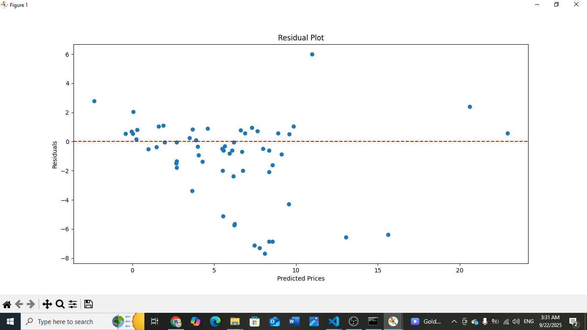
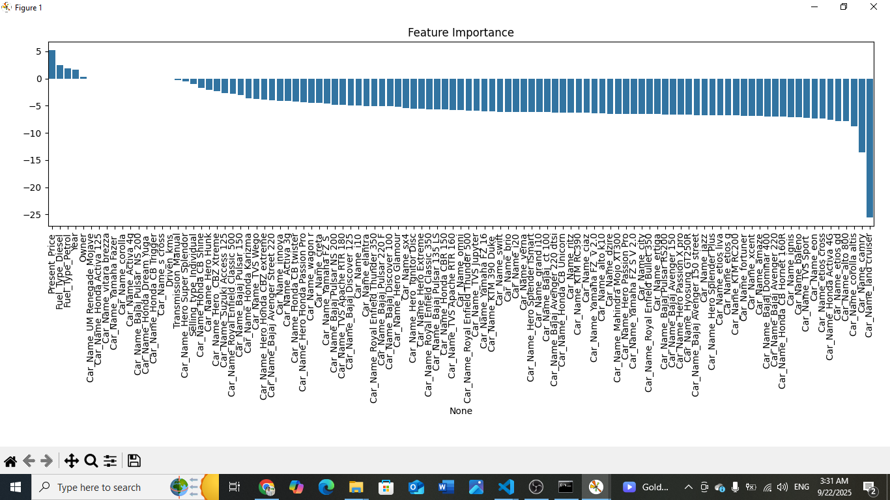
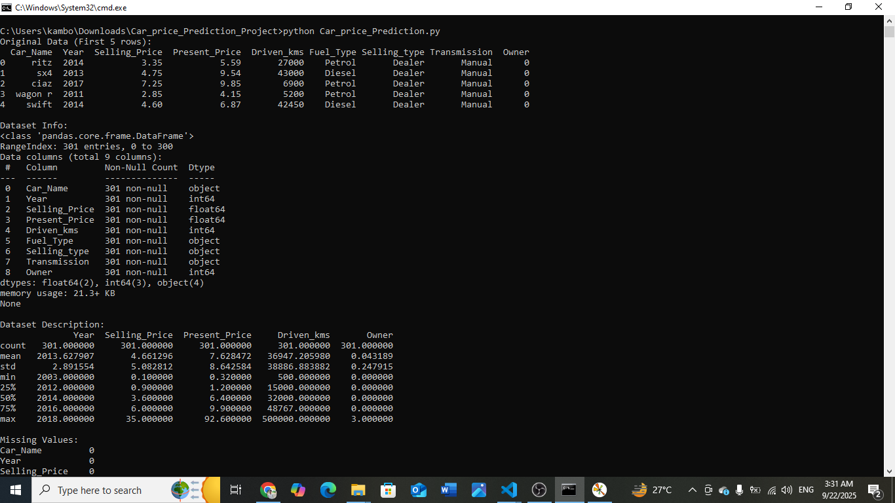

# 🚗 Car Price Prediction | Python Machine Learning Project  

A beginner-friendly **Python + Machine Learning project** to predict **used car prices**.  
This project focuses on **data cleaning, feature engineering, and regression modeling** while demonstrating real-world applications of price prediction in the automobile industry.  

---

## 📋 Table of Contents  
- 📚 Project Overview  
- 🚀 Features  
- 🧠 Concepts Covered  
- ⚙️ Installation  
- 🎮 How to Use  
- 📊 Results & Plots  
- 📸 Screenshots  
- 🚧 Future Enhancements  
- ✨ Author  
- 📄 License  

---

## 📚 Project Overview  

This project uses a **car dataset** to:  
- Predict resale values of cars using **Linear Regression**  
- Perform **data preprocessing & scaling**  
- Visualize **feature importance & residuals**  
- Demonstrate **real-world ML applications** like car dealerships, marketplaces, banks, and insurance companies  

The project demonstrates the use of **Python for Machine Learning & Data Science** with libraries like Pandas, Scikit-learn, Matplotlib, and Seaborn.  

---

## 🚀 Features  

- Load car dataset from **CSV**  
- Clean and preprocess data (missing values, categorical encoding, feature scaling)  
- Train **Linear Regression model**  
- Evaluate using **MAE** & **R² Score**  
- Visualize **residuals** and **feature importance**  
- Save cleaned dataset for future use  

---

## 🧠 Concepts Covered  

- Data Cleaning (handling nulls, encoding categorical variables)  
- Feature Scaling (Standardization)  
- Train-Test Split & Model Training  
- Evaluation Metrics (**MAE, R²**)  
- Data Visualization (**Residual Plot, Feature Importance**)  
- File handling with Pandas (`.csv`)  

---

## ⚙️ Installation  

Clone the repository:
git clone https://github.com/TalalLiaquat/CodeAlpha_Car_Price_Prediction.git
cd CodeAlpha_Car_Price_Prediction

---
## Install dependencies:

Copy code
pip install -r requirements.txt

---
## 🎮 How to Use

Run the script:
python car_price_prediction_fixed.py

The script will:
Train the ML model

Print evaluation results (MAE, R² Score)

Save cleaned_car_data.csv

Generate plots for Residuals and Feature Importance

---

## 📊 Results & Plots
Mean Absolute Error (MAE): ~2.03

R² Score: ~0.59

## 📸 Screenshots

### ▶ Plot  
  

### ▶ Graph  
  

### ▶ Output 
  

---

## 🚧 Future Enhancements

Try advanced models (Random Forest, XGBoost)
Build a web app using Streamlit or Flask
Add a user input form for predicting custom car prices
Improve model accuracy with hyperparameter tuning
Create an interactive dashboard for visualization

---

## ✨ Author
Developed by ❤️ M. Talal Liaquat ❤️

LinkedIn:[ Talal Liaquat](https://www.linkedin.com/in/talal-liaquat/)

---

## 📄 License
This project is licensed under the MIT License.
